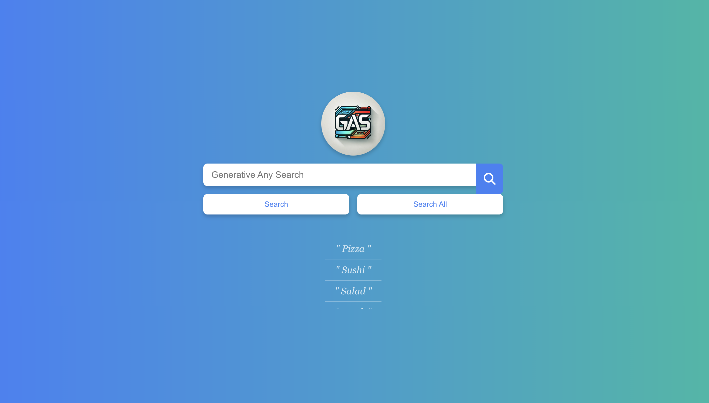
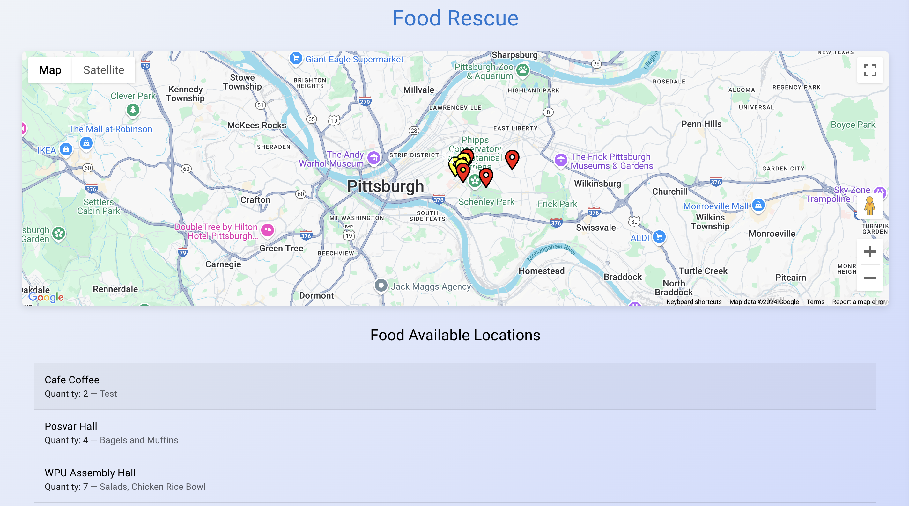
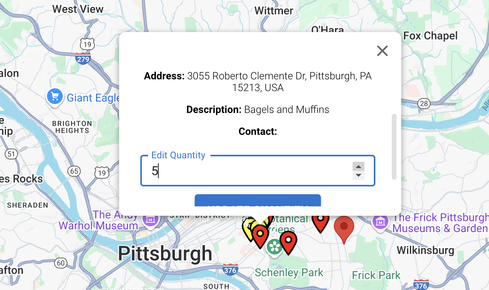

# generative-food-search
**Developed during SteelHacks XI hackathon**, this solution takes food rescue a step further. The frontend is built with **React** and **Material UI** for a sleek, responsive user interface. **ChromaDB**, a vector database, supports efficient cosine similarity searches, enabling advanced querying capabilities. Python **FastAPI** serves as the backend, providing a high-performance and scalable API for handling requests. **Firebase Realtime Database** is used for data storage and synchronization, ensuring real-time updates for users.

